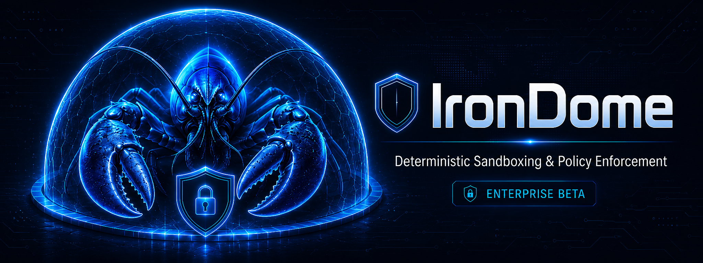

# Iron Dome 🛡️

**Deterministic runtime sandbox and behavioral analysis for supply-chain security.**

[](https://github.com/KirkForge/IronDome/actions/workflows/ci.yml)
[](https://pypi.org/project/irondome/)
[](https://www.python.org/)
[](https://github.com/KirkForge/IronDome)
[](SCAAT.md)
[](SLSA.md)
[](LICENSE)



Iron Dome is a two-layer defense system for npm/Python supply chains. Companion to [PicoSentry](https://github.com/KirkForge/PicoSentry) — static scan → runtime sandbox.

- **L3 Execution Sandbox** — Run any command under kernel-level policy. Real seccomp-bpf (Linux), Seatbelt/sandbox-exec (macOS), or universal subprocess backend.
- **L4 Behavioral Analysis** — Post-execution profiling. Detect exfiltration, timing anomalies, honeypot touches, entropy spikes, and baseline drift.

## Why Iron Dome?

Static scanners (PicoSentry, Socket.dev, Snyk) inspect code. Iron Dome **executes** it safely, catching what static analysis misses: dependency confusion with dynamic payloads, post-install data exfiltration, obfuscated eval chains, and supply-chain worms.

## Quick Start

```bash
pip install irondome

# L3: Sandbox a command
irondome sandbox python3 -c "print('hello')"

# L3+L4: Full pipeline
irondome pipeline npm install some-package

# Analyze existing sandbox output
irondome sandbox --format json npm test > sandbox.json
irondome analyze --input sandbox.json

# List detector rules
irondome rules

# Verify determinism (run twice, compare SHA-256)
irondome sandbox --verify-determinism echo test

# Compare two saved results
irondome diff result_a.json result_b.json

# Workspace scanning (monorepos)
irondome pipeline --workspace /path/to/monorepo
```

## L3 Backends

Iron Dome auto-detects the best available backend:

| Backend | Platform | Mechanism | Isolation Level | Enforcement |
|---------|----------|-----------|-----------------|-------------|
| **seccomp-bpf** | Linux | Kernel syscall filtering via libseccomp (ctypes), fork+exec | syscall_policy | moderate |
| **seatbelt** | macOS | sandbox-exec with generated profile DSL | os_policy_enforced | hard |
| **subprocess** | Universal | Process isolation with post-hoc pattern analysis | observational_only | best_effort |

**Important**: The subprocess backend is **observational only** — it detects suspicious patterns in
output but does not prevent syscalls. It is not a true sandbox.

**Important**: The seccomp-bpf backend is a **syscall policy harness**, not a full containment boundary.
It filters syscalls at the kernel level (real enforcement), but does not provide namespace/mount/filesystem
isolation, `prctl(PR_SET_NO_NEW_PRIVS)`, privilege dropping, or `setrlimit`. For safe execution of
untrusted packages, compose with user namespaces, `bubblewrap`, or `gVisor`. Default-deny policies will
kill processes on missing syscalls (e.g. `clone3`, `wait4`) — use `--allow-runtime node` or the
per-runtime profiles for common package managers, or use default-allow with explicit deny rules.

Use `--backend seccomp-bpf` (or `IRONDOME_SANDBOX_BACKEND=seccomp-bpf`) to require a specific
backend. If the requested backend is unavailable, Iron Dome **fails closed** by default. Use
`--allow-degraded` (or `IRONDOME_ALLOW_DEGRADED=1`) to opt into subprocess fallback explicitly.

## L3 Suspicious Pattern Detectors

| Rule | Detects |
|------|---------|
| L3-SUS-001 | Dynamic code execution (eval, exec, compile) |
| L3-SUS-002 | Shell execution (subprocess, os.system, os.popen) |
| L3-SUS-003 | Sensitive file access (/etc/passwd, /etc/shadow) |
| L3-SUS-004 | Network tool usage (curl, wget, nc, telnet) |
| L3-SUS-005 | Permission escalation (chmod +x, chmod 777) |
| L3-SUS-006 | Base64 decoding |
| L3-SUS-007 | Destructive commands (rm -rf /, dd if=/dev) |
| L3-SUS-008 | Process introspection (/proc/self, ptrace) |
| L3-SUS-009 | SSH key access (.ssh/, id_rsa, id_ed25519) |
| L3-SUS-010 | Dotfile access (/root/, /home/*/.) |

## L4 Behavioral Detector Rules

| Rule | Detects | Severity |
|------|---------|----------|
| L4-TIME | Anomalous timing, no-op, busy-wait | MEDIUM/HIGH |
| L4-EXFIL | Data exfiltration, suspicious DNS, credential theft | CRITICAL/HIGH/MEDIUM |
| L4-ENTROPY | High-entropy filenames, DGA domains | MEDIUM/HIGH |
| L4-HONEY | Honeypot path access, priv-esc binaries | CRITICAL |
| L4-BASE | Baseline drift from known-good profiles | CRITICAL/MEDIUM/INFO |

## Shipped Baselines

- `npm-install` — npm install/publish behavior
- `python-pip-install` — pip install behavior
- `node-script` — Node.js script execution
- `python-script` — Python script execution
- `curl-wget` — Download utilities

Custom baselines can be loaded from JSON files.

## Output Formats

| Format | Use Case |
|--------|----------|
| **Table** | Human-readable terminal output with verdict icons |
| **JSON** | Machine-readable, deterministic (sha256 repeatable) |
| **SARIF 2.1.0** | GitHub code scanning, VS Code, CI integration |
| **ML Context** | Token-budgeted context for LLM pipelines |
| **GitHub** | GitHub Actions annotation format |
| **CycloneDX** | SBOM and vulnerability format for compliance |

## Determinism Guarantee

`sha256(scan_a) == sha256(scan_b)` on identical inputs. No random IDs in findings, no timestamps in evidence, frozen dataclasses throughout. Enforced by a 4-layer guard stack:

```
┌─────────────────────────────────────────┐
│  Layer 4: CI Gate                       │
│  --verify-determinism (CLI)             │
│  Runs scan twice, asserts SHA-256 match │
├─────────────────────────────────────────┤
│  Layer 3: Diff                          │
│  irondome diff a.json b.json            │
│  Compare two saved scans field-by-field │
├─────────────────────────────────────────┤
│  Layer 2: Guard (runtime)               │
│  Validates invariants after each scan:  │
│  - No uuid4/random in findings          │
│  - No timestamps in findings            │
│  - Findings sorted by sort_key()        │
│  - run_id is deterministic (empty)      │
├─────────────────────────────────────────┤
│  Layer 1: Models (structural)           │
│  Finding(frozen=True), sorted keys,     │
│  no random IDs, no prose in output      │
└─────────────────────────────────────────┘
```

## Configuration

Iron Dome reads `.irondome.yml` or `.irondome.yaml` from the target directory:

```yaml
version: 1
format: json
fail_on: high
deterministic_output: true
timeout: 30.0
severity_overrides:
  L4-TIME: low
  L4-ENTROPY: info
```

Environment variables (`IRONDOME_*`) override config, and CLI flags override everything.

## Security

- **Determinism vulnerability reporting**: See [SECURITY.md](SECURITY.md)
- **Threat model**: See [docs/security/threat-model.md](docs/security/threat-model.md)
- **Release integrity**: Sigstore-signed releases with SLSA L3 provenance. See [SLSA.md](SLSA.md)
- **Zero hard runtime dependencies**: Only `pyyaml` (optional) and `libseccomp` (optional, system library)

## Documentation

- [SECURITY.md](SECURITY.md) — Vulnerability reporting and security policy
- [CONTRIBUTING.md](CONTRIBUTING.md) — Development guide and rule requirements
- [SLSA.md](SLSA.md) — Supply-chain Levels attestation
- [SCAAT.md](SCAAT.md) — Supply-chain attack vector mapping
- [CHANGELOG.md](CHANGELOG.md) — Version history
- [docs/runbooks/](docs/runbooks/) — Operational runbooks
- [docs/security/](docs/security/) — Security documentation

## Development

```bash
pip install -e ".[dev]"
python -m pytest -v              # 295 tests
irondome sandbox echo ci-test   # Quick self-test
bash scripts/ci.sh              # Full CI: mypy, ruff, pytest, determinism
```

See [CONTRIBUTING.md](CONTRIBUTING.md) for the full development guide.

## License

PolyForm Noncommercial License 1.0.0 — free for personal, educational, research, hobby, and other non-commercial use. Commercial use requires a separate commercial license from KirkForge. See [LICENSE](LICENSE), [LICENSE-SUMMARY.md](LICENSE-SUMMARY.md), and [COMMERCIAL-LICENSE.md](COMMERCIAL-LICENSE.md).

## Related

- [PicoSentry](https://github.com/KirkForge/PicoSentry) — Deterministic npm/pnpm supply-chain scanner (L2, 21 rules, 1390+ tests)
- [55NDeep](https://github.com/KirkForge/55NDeep-plugin) — Codex verification and delegation plugin
